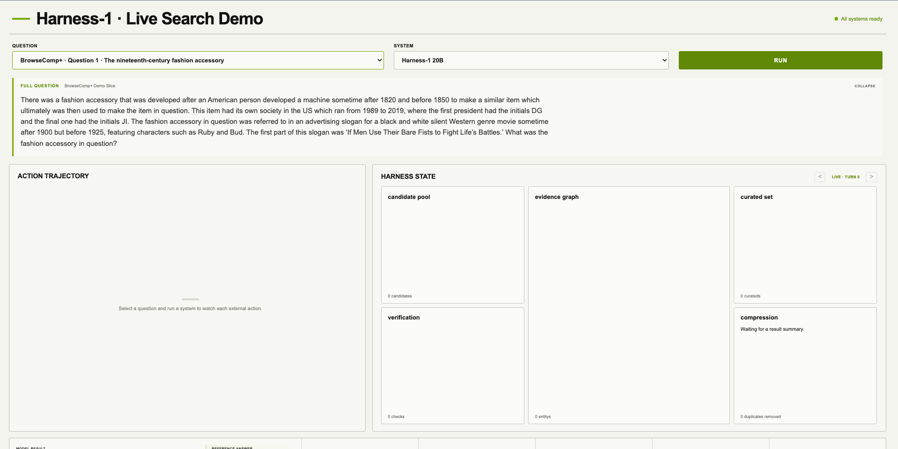
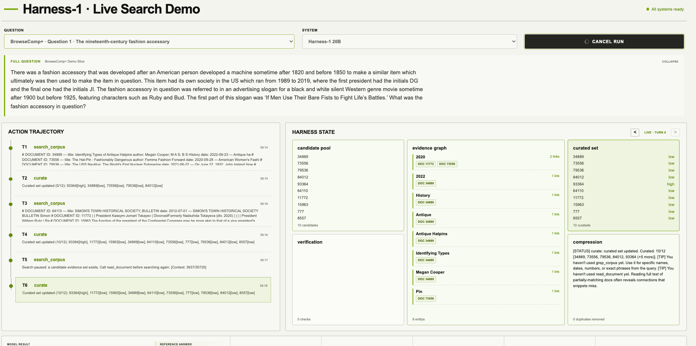
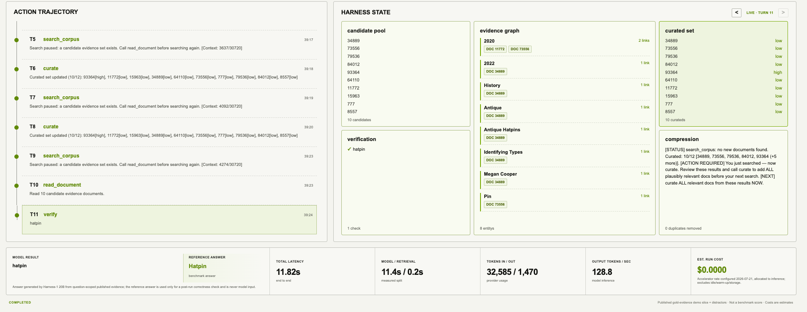

# Harness-1 Live Search Demo

Presentation demo comparing Harness-1 20B running behind a state-externalizing retrieval harness with a GPT-4o mini search baseline.

The presentation workstation hosts the UI, API, retrieval index, and harness state. A configurable remote GPU host serves only the Harness-1 checkpoint through vLLM.

## Demo walkthrough

### Ready

Choose one of the prevalidated BrowseComp+ Demo Slice questions and either Harness-1 20B or GPT-4o mini.



### Live research

The action trajectory streams alongside the externalized candidate pool, evidence graph, curated set, verification, and compressed working state.



### Verified result

The completed view preserves the full trajectory and evidence links, then shows the generated answer beside the hidden benchmark reference and measured run telemetry.



## Architecture

| Component | Deployment location | Configuration |
| --- | --- | --- |
| React UI, FastAPI, retrieval, and Harness state | Presentation workstation | `DEMO_PORT`, `DEMO_DATA_DIR`, `DEMO_REPLAY_DIR` |
| Harness-1 20B checkpoint and vLLM | Remote GPU host over SSH | `HARNESS1_REMOTE_HOST`, `HARNESS1_GPU_DEVICE`, `HARNESS1_REMOTE_ROOT`, `HARNESS1_REMOTE_PORT` |
| Frontier-model baseline | Any OpenAI-compatible API | `FRONTIER_BASE_URL`, `FRONTIER_API_KEY`, `OPENAI_FRONTIER_MODEL` |
| Optional dense embeddings | Any OpenAI-compatible embeddings API | `EMBEDDING_BASE_URL`, `EMBEDDING_API_KEY`, `OPENAI_EMBEDDING_MODEL` |
| Browser/API connection | One local origin | `http://127.0.0.1:${DEMO_PORT:-8787}` |

Actual hostnames, endpoint URLs, GPU assignments, filesystem paths, and credentials belong only in the ignored `.env.local` file. The repository contains no deployment-specific values.

The UI shows public actions and Harness state changes, never private reasoning or chain-of-thought. Each selected question searches a disclosed slice containing its published gold-evidence documents plus deterministic distractors. Results are capability demonstrations labeled **BrowseComp+ Demo Slice**, not full benchmark scores.

## Local setup

Requirements: Python 3.11+, `uv`, Node.js, `pnpm`, Git submodules, and passwordless SSH to the GPU host configured in `.env.local`.

```bash
git submodule update --init --recursive
cp .env.example .env.local
# Add credentials and instance configuration to .env.local.
# Replace every placeholder required by the services you intend to run.
# FRONTIER_* configures the comparison model.
# EMBEDDING_* is optional; retrieval falls back to BM25 without it.
# HARNESS1_REMOTE_* configures the SSH-accessible vLLM host.
uv sync --group dev
pnpm --dir frontend install --frozen-lockfile
scripts/build_corpus.sh
```

Never commit `.env` or `.env.local`. Start the production UI and API on one local origin with:

```bash
scripts/demo.sh
```

Then open `http://127.0.0.1:8787`. The four checked-in recovery fixtures cover both systems on both selected questions and are explicitly labeled as non-live. Each successful live run automatically replaces the corresponding fixture.

## Remote model operations

All remote operations load `.env.local` automatically and fail fast if a required value is missing:

```bash
scripts/remote/deploy.sh  # deploy or replace the vLLM container
scripts/remote/health.sh  # verify container and HTTP readiness
scripts/remote/tunnel.sh  # open the reconnecting SSH tunnel
scripts/remote/smoke.sh   # exercise the local completion endpoint
scripts/remote/logs.sh    # follow container logs
scripts/remote/stop.sh    # stop while retaining the checkpoint cache
scripts/remote/start.sh   # restart an existing container
```

Prevalidate the complete live matrix twice before the event:

```bash
uv run python scripts/prevalidate_demo.py --rounds 2
```

## Verification

```bash
uv run ruff check demo tests scripts/generate_seed_replays.py
uv run pytest
pnpm --dir frontend run typecheck
pnpm --dir frontend test
pnpm --dir frontend run build
```

See [PLAN.md](PLAN.md), [remote inference setup](docs/REMOTE_INFERENCE.md), and the [event-day runbook](docs/EVENT_DAY.md).

Reference token pricing is dated in `.env.example`; actual provider accounting may differ. Harness cost uses the configured accelerator rate and allocates only measured model-inference time. The UI labels all costs as estimates.
